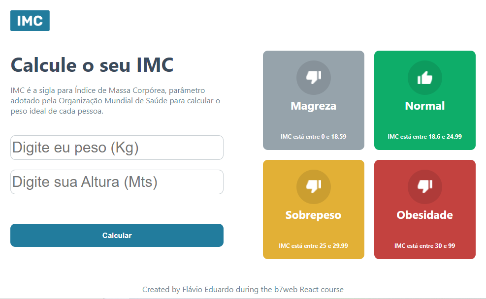

# Calculadora de IMC
## Projeto em React com Vite + Typescript 
### Desenvolvido durante o curso [B7Web](https://alunos.b7web.com.br) 2022.
###
Link: https://projeto-calculadora-imc-hazel.vercel.app/

### Instalação :
- `npm install`

### Para rodar :
- `npm run dev`

#

